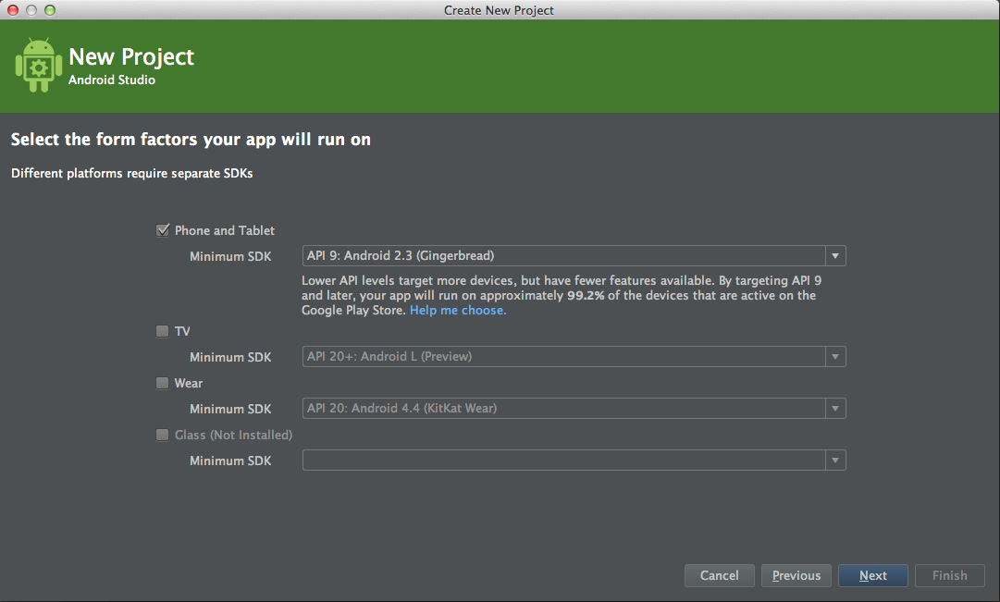
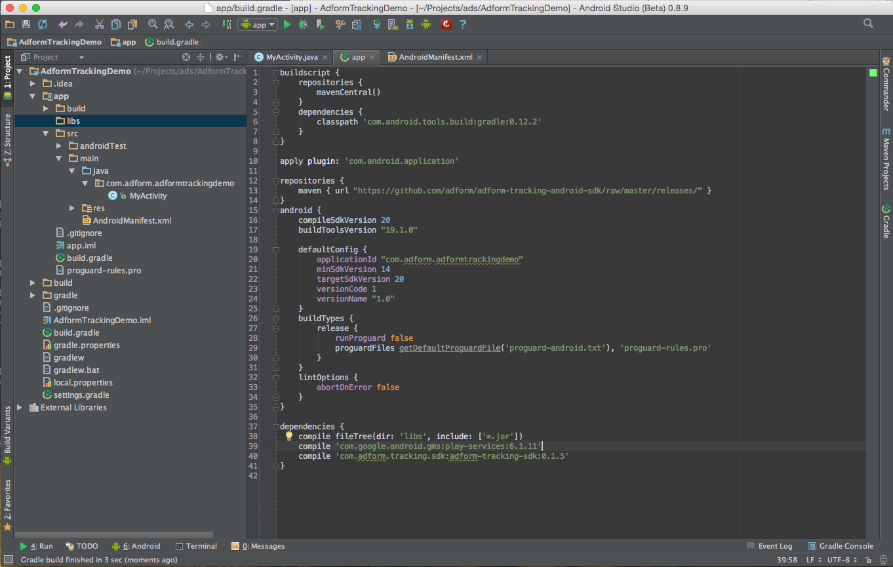
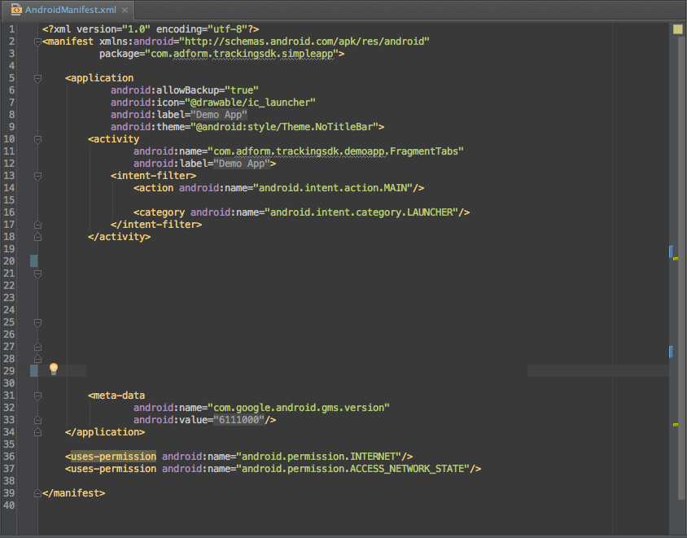
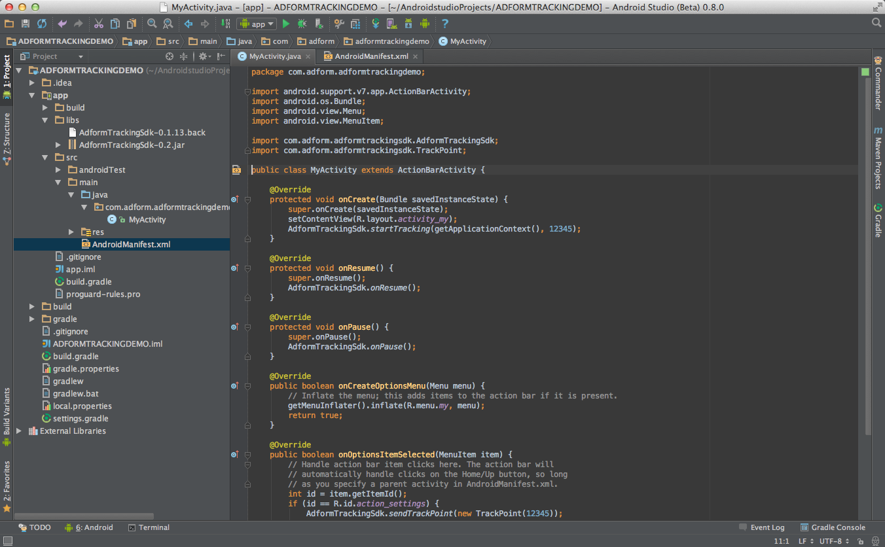

# Getting Started

When you run mobile campaigns, boost of new app installs are often one of the main goals. We are happy to announce that today we are launching app installs solution for iOS and Android devices. Easy to install SDK will enable campaign app installs tracking and reporting in Adform platform without need to deal with 3rd party SDKs and invest tons of time into that.

## 1. General Info

* Adform Tracking SDK runs on Android 2.3.* (API 10), so created project version should be 2.3.* (API 10) and above
* Also the instructions described here are done on IntelliJ 13.1. These instructions should be compatible with Android Studio also



## 2. Setting up library dependencies

* To add a library to the dependencies, first we need to specify repository location. This can be done by editing `build.gradle` file and by inserting snippet (specified below) right above the `android` configuration group. 

	    ...
		repositories {
    		maven { url "https://github.com/adform/adform-tracking-android-sdk/raw/master/releases/" }
		}
        ...


* Then in the dependency group we need to specify that we will be using `AdformTrackingSdk`, and also add `Google Play Ads` service.
		
	    ...
        dependencies {
		    compile 'com.google.android.gms:play-services-ads:8.1.0'
    		compile 'com.adform.tracking.sdk:adform-tracking-sdk:1.1.0'
        }
        ...
        
* How to add Google Play Services to Your Project please follow these instructions: https://developer.android.com/google/play-services/setup.html#Setup



## 3. Update AndroidManifest.xml


* Add internet reachability permissions. Update `AndroidManifest.xml` file with snippet shown below between `<manifest></manifest>` tags.

		<uses-permission android:name="android.permission.INTERNET" />
		<uses-permission android:name="android.permission.ACCESS_NETWORK_STATE" />
		    
* Also additional android services are needed to work properly. To add them, update `AndroidManifest.xml` with snipped shown below between `<application></application>` tags.

        <receiver
            android:name="com.adform.adformtrackingsdk.services.ReferrerReceiver"
            android:exported="true">
            <intent-filter>
                <action android:name="com.android.vending.INSTALL_REFERRER" />
            </intent-filter>
        </receiver>
        <meta-data
            android:name="com.google.android.gms.version"
            android:value="@integer/google_play_services_version"/>
            


Now you are set to use sdk. 

# Basic integration
## Start tracking
		
To start tracking, you need to 	run `startTracking` method. Note that `Tracking_ID` should be replaced with your tracking id.

```java
	AdformTrackingSdk.startTracking(this, Tracking_ID);
```
		
A good place to put it is Activity/Fragment onCreate() method. Alternatively this can also be done in Application class, as this method should be started only once and will not take any affect when running multiple times. 

Also, AdformTrackingSdk needs methods that would indicate of application activity, such as `onResume` and `onPause`. 

*Note that an old method* ***onStop was deprecated*** *and will not be used in the future, so it should be deleted if it was used before.*

```java
    @Override
    protected void onResume() {
        super.onResume();
        AdformTrackingSdk.onResume(this);
    }

    @Override
    protected void onPause() {
        super.onPause();
        AdformTrackingSdk.onPause();
    }
```
    


 
 * Optionally you can set custom application name and custom variables before calling `startTracking:`.
	
	```java
		AdformTrackingSdk.setAppName("Custom app name");
	
		Order order = new Order();
		order.setCurrency("currency");
		order.setOrderStatus("order status");
		order.setEmail("email");
		order.setOrderId("order id");
		
		// You can also set other custom variables.
	    order.addCustomValue(1, "var1 value"); //Set index (1-10) of custom variable and value
	    order.addSystemValue(5, "sv5 value"); //Set index (1-89) of system variable and value
	    order.addNumericValue(3, 45.4); //Set index (1 or 2) of numeric system variable and value (numeric format)
	
		AdformTrackingSdk.startTracking(this, Tracking_ID);
	```
    		
## Sending custom app events    		
To create an event, first you need to create a TrackPoint with `Tracking_ID`. Note that `startTracking` should occur before event sending.

```java
TrackPoint trackPoint = new TrackPoint(Tracking_ID);
```
	
Also some advanced integrations are available, like custom variables or using custom application name setting. 

* Setting custom application name: 

	```java
		trackPoint.setAppName("custom application name");
	```
	
* In order to send custom variables you need to create `Order` object and set your order values. When defining variables it's required to keep in mind, that there are different type of variables:
	
  * Custom variables with predefined names (orderid, currency, firstname, etc.)
  * Custom variables (var1-var10)
  * System variables (sv1-sv89)
  * Numeric system variables (svn1, svn2)


	```java
		Order order = new Order();
		order.setCurrency("currency");
		order.setOrderStatus("order status");
		order.setEmail("email");
		order.setFirstName("name");
		order.setLastName("last name");
		order.setAddress1("address 1");
		order.setAddress2("address 2");
		order.setPhone("phone");
		order.setZip("zip");
		order.setCountry("country");
		order.setAgeGroup("age group");
		order.setGender("gender");
		order.setOrderId("order id");
		order.setSale(44.54); //numeric format
		
		// You can also set other custom variables.
	    order.addCustomValue(1, "var1 value"); //Set index (1-10) of custom variable and value
	    order.addSystemValue(5, "sv5 value"); //Set index (1-89) of system variable and value
	    order.addNumericValue(3, 45.4); //Set index (1 or 2) of numeric system variable and value (numeric format)
		
		//Set created order for the trackpoint
		trackPoint.setOrder(order);
		
	```

* Setting custom tracking point name:

	```java
		trackPoint.setSectionName("Tracking point name");
	```
	
To send prepared track point, just use `sendTrackPoint`.

```java
AdformTrackingSdk.sendTrackPoint(trackPoint);
```


Also it is posible to send additional product variables information with tracking points. To do so you need to create 'ProductItem' object and set your product values. Then add that object to the trackpoint.

```java
	ProductItem productItem = new ProductItem();
	productItem.setProductId("Product ID");
    productItem.setProductName("Product name");
    productItem.setCategoryId("Category ID");
    productItem.setCategoryName("Category name");
    productItem.setProductCount("Product count");
    productItem.setProductSales("Product sales");
    productItem.setWeight("Weight");
    productItem.setStep("Step");
    productItem.setCustom("Custom information");
        
    TrackPoint trackPoint = new TrackPoint(Tracking_ID);
    trackPoint.addProductItem(productItem);
```

To send multiple product variables with same tracking point, you can use such code:

```java
	ProductItem productItem1 = new ProductItem();
	productItem1.setProductId("Product ID");
    productItem1.setProductName("Product name");
    productItem1.setCategoryId("Category ID");
    productItem1.setCategoryName("Category name");
    productItem1.setProductCount("Product count");
    productItem1.setProductSales("Product sales");
    productItem1.setWeight("Weight");
    productItem1.setStep("Step");
    productItem1.setCustom("Custom information");
        
	ProductItem productItem2 = new ProductItem();
	productItem2.setProductId("Product ID");
    productItem2.setProductName("Product name");
    productItem2.setCategoryId("Category ID");
    productItem2.setCategoryName("Category name");
    productItem2.setProductCount("Product count");
    productItem2.setProductSales("Product sales");
    productItem2.setWeight("Weight");
    productItem2.setStep("Step");
    productItem2.setCustom("Custom information");
        
    TrackPoint trackPoint = new TrackPoint(Tracking_ID);
    trackPoint.addProductItem(productItem1);
    trackPoint.addProductItem(productItem2);
```
    
# Custom Adform Tracking SDK implementations

## Enable/Disable tracking
You can enable/disable tracking by calling `setEnabled(boolean)` method.

```java
	AdformTrackingSdk.setEnabled(true);
```
	
## Enable/Disable HTTPS
You can enable/disable HTTPS protocol by calling `setHttpsEnabled(boolean)` method. By default HTTPS is enabled.

```java
	AdformTrackingSdk.setHttpsEnabled(true);
```
	
## Enable/Disable SIM card state tracking
You can enable/disable tracking by calling `setSendSimCardStateEnabled(boolean)` method. By default SIM card state tracking is disabled.

```java
	AdformTrackingSdk.setSendSimCardStateEnabled(true);
```

## Information sending to multiple clients

It is possible to send tracking information to multiple clients by defining each client Tracking id. 

In order to start tracking, please use an example below:

```java
	 AdformTrackingSdk.startTracking(this, Tracking_ID1, Tracking_ID2, Tracking_ID3, ...);
```
To send custom tracking points for multiple clients, use the following example:

```java
      MultipleTrackPointsBuilder multipleTrackPointsBuilder = new MultipleTrackPointsBuilder();
         
      multipleTrackPointsBuilder
     		.setAppName("App name")
            .setSectionName("Section name");
            .setOrder(yourOrder);

      TrackPoint[] trackPoints = multipleTrackPointsBuilder.generateTrackPoints(Tracking_ID1, Tracking_ID2, Tracking_ID3, ...);

      AdformTrackingSdk.sendTrackPoints(trackPoints);
```

# Migration guide

## Upgrading to 1.1

In SDK version 1.1 was added functionality, which requires additional changes during update from older versions:

* Method `setParameters()` of `TrackPoint` class has been deprecated. Instead please use `setOrder()` method to set custom variables to tracking points.

