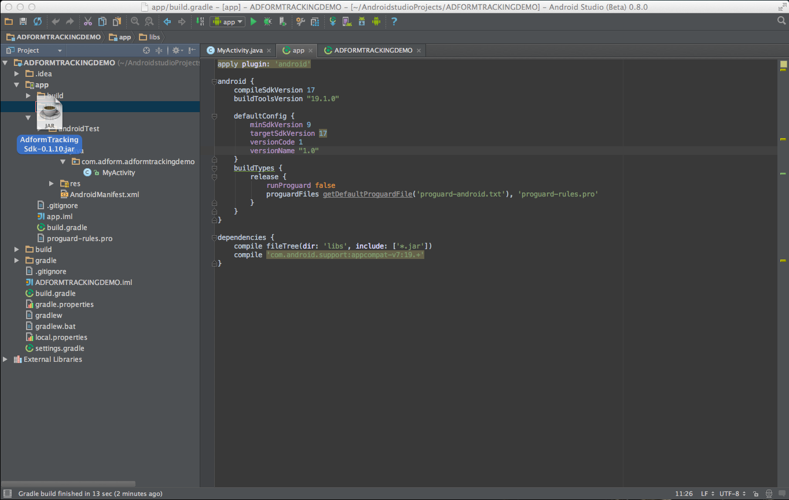
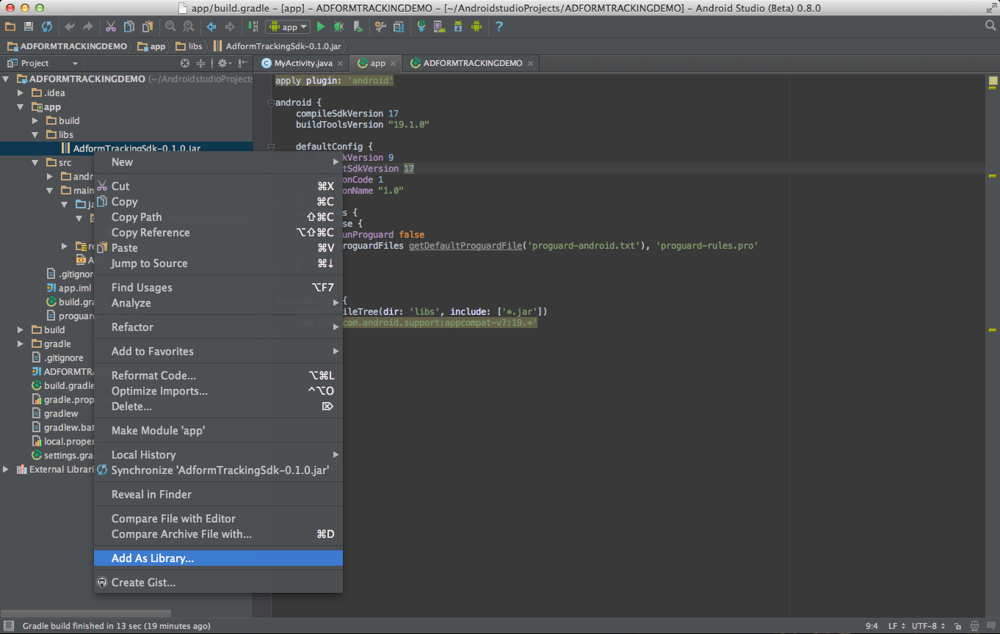
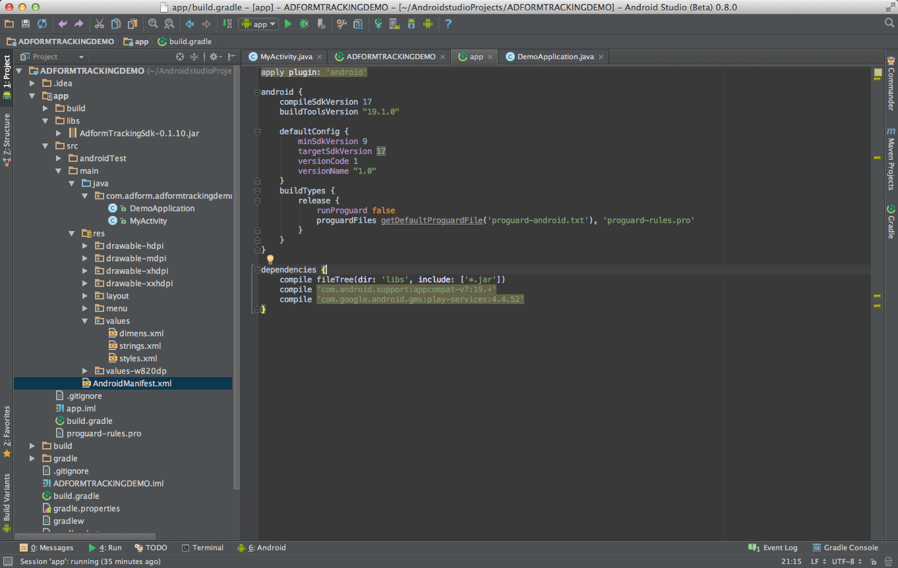
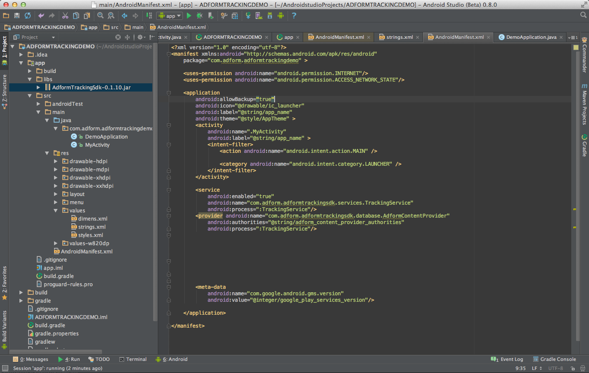
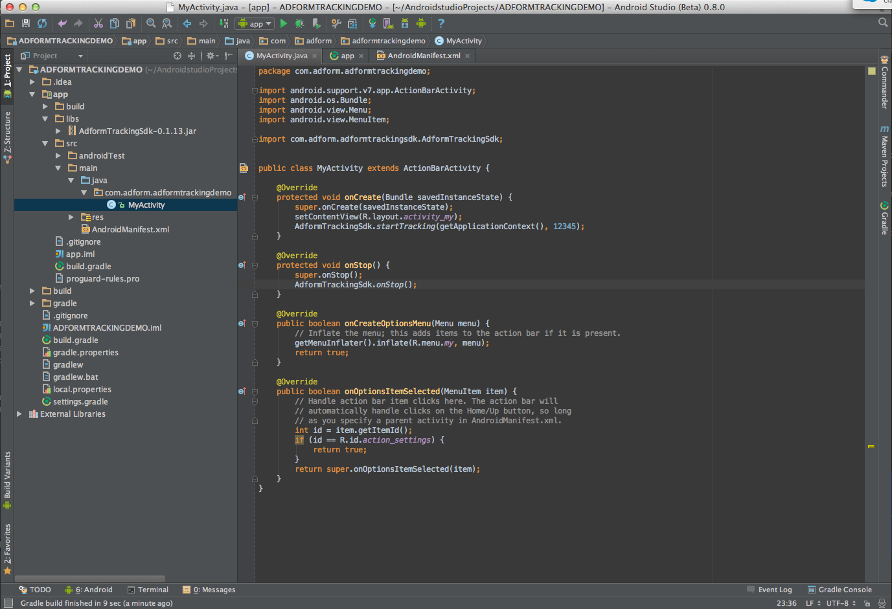
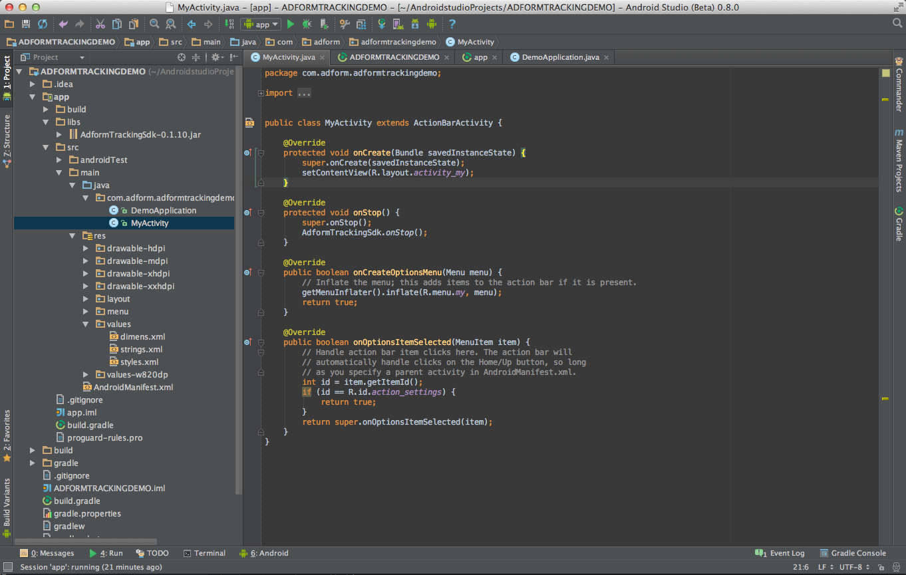
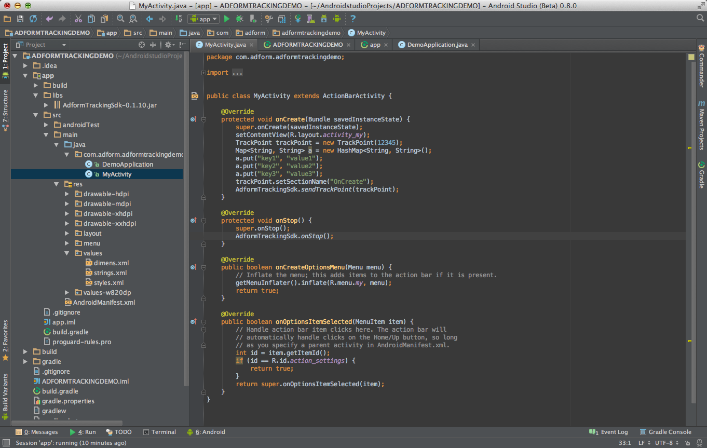

# Getting Started

When you run mobile campaigns, boost of new app installs are often one of the main goals. We are happy to announce that today we are launching app installs solution for iOS and Android devices. Easy to install SDK will enable campaign app installs tracking and reporting in Adform platform without need to deal with 3rd party SDKs and invest tons of time into that.

## 1. General Info

* Adform Tracking SDK runs on Android 2.3.* (API 10), so created project version should be 2.3.* (API 10) and above
* Also the instructions described here are done on IntelliJ 13.1. These instructions should be compatible with Android Studio also

## 2. Copy the contents of the libs folder directly the libs/ folder of your project.

* Download project library `AdformTrackingSdk-x.x.x.jar` latest version. 
* Insert library into your project.

* Right click it and hit `Add as Library...`

## 3. Set up Google Play and Adform Tracking SDK

* AdformTrackingSdk needs Google Play services. That can be done by inserting `Google Play` service dependency into `build.gradle` file.
		
	    ...
        dependencies {
            compile 'com.google.android.gms:play-services:5.0.89'
            compile fileTree(dir: 'libs', include: ['*.jar'])
        }
        ...
* How to add Google Play Services to Your Project please follow these instructions: https://developer.android.com/google/play-services/setup.html#Setup

## 4. Update AndroidManifest.xml

* Add internet reachability permissions. Update `AndroidManifest.xml` file with snippet shown below between `<manifest></manifest>` tags.

		<uses-permission android:name="android.permission.INTERNET" />
		<uses-permission android:name="android.permission.ACCESS_NETWORK_STATE" />
		    
* Also additional android services are needed to work properly. To add them, update `AndroidManifest.xml` with snipped shown below between `<application></application>` tags.

        <service  android:enabled="true"
                  android:name="com.adform.adformtrackingsdk.services.TrackingService"
                  android:process=":TrackingService"/>
        <provider android:name="com.adform.adformtrackingsdk.database.AdformContentProvider"
                  android:authorities="@string/adform_content_provider_authorities"
                  android:process=":TrackingService"/>
                  
        <receiver
                android:name="com.adform.adformtrackingsdk.services.ReferrerReceiver"
                android:exported="true">
            <intent-filter>
                <action android:name="com.android.vending.INSTALL_REFERRER" />
            </intent-filter>
        </receiver>
        
        <meta-data android:name="com.google.android.gms.version"
	               android:value="@integer/google_play_services_version" />

* A unique identifier must be added in `strings.xml` file. Please note that `[appname]` should be replaced with your application name.
	
		<string name="adform_content_provider_authorities">com.adform.AdformContentProvider.[appname]</string>

		
Now you are set to use sdk. 

# Basic integration
## Start tracking
		
To start tracking, you need to 	run `startTracking` method. Note that `[tracking id]` should be replaced with your tracking id.

	AdformTrackingSdk.startTracking(getApplicationContext(), [tracking id]);
		
A good place to put it is onCreate() method. Note that tracking start should occur before event sending. 

Also, AdformTrackingSdk needs a stop method, to notify when to stop its operation.

    @Override
    protected void onStop() {
        AdformTrackingSdk.onStop();
        super.onStop();
    }

    		
## Sending events    		
To create an event, first you need to create a TrackingPoint with `[tracking id]`. 

	TrackPoint trackPoint = new TrackPoint([tracking id]);
	
Also some advanced integrations are available, like custom parameter set, or using custom application name. 

* Setting section name: 

		trackingPoint.setDefaultApplicationName("custom application name");
		
* Adding custom parameters:
	
		Map<String, String> map = new HashMap();
		map.put("key", "value");
		trackingPoint.setCustomParameters(map);

* Adding section name:
	
		trackingPoint.setSectionName("section name");
		
To send a ready tracking point, just use `sendTrackPoint`.

	AdformTrackingSdk.sendTrackPoint(trackPoint);

# Advanced integration

## Send custom events when starting track
To send custom parameters when starting track, you can add them **before** using `startTracking` method.

    Map<String, String> map = new HashMap();
    map.put("var1", "Custom Value 1");
    map.put("var2", "Custom Value 2");
    map.put("var3", "Custom Value 3");
    AdformTrackingSdk.setParameters(map);
    
This also applies when you want to send custom application name.

	AdformTrackingSdk.setAppName("Custom application name");
	

